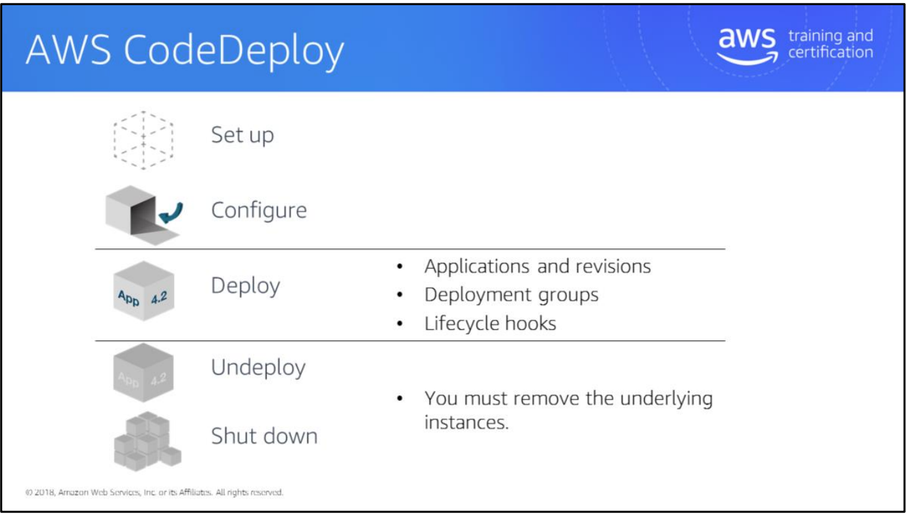
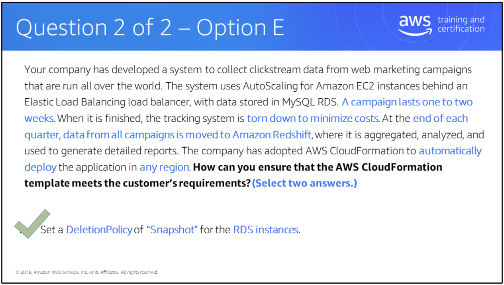

# Module6:Deployment Management

AWS has several services that can be used for different aspects of deployment.

This slide and the subsequent slides place those services into different layers to help you understand which services are typically used for which purpose.

**AWS Elastic Beanstal**

Elastic Beanstalk appears in all four deployment categories. Why wouldn’t you simply use it for everything?

Elastic Beanstalk has strong requirements for the way an application is architected. It works best when you use a two-tier or three-tier application. The service offers a choice between web or worker tier, RDS database tier, and possibly a load balancer. A web tier is typically behind a load balancer. A worker tier uses an SQS queue. Elastic Beanstalk deploys only to Amazon EC2 instances, not to systems outside AWS.

Elastic Beanstalk can be extended to include other AWS services. However, it won’t actively manage those other services.

If your application fits into the Beanstalk model, it’s a great starting point.

**AWS OpsWorks**

OpsWorks has a DevOps focus. It allows ongoing management of your environment, and provides more control than Elastic Beanstalk. For example, you can do rolling upgrades of the EC2 instance operating systems or install custom software via Chef recipes. OpsWorks can manage systems in Amazon EC2 and systems that are external to AWS. It does not follow the concept of multiple application versions.

**AWS CloudFormation**

AWS CloudFormation deploys environments based on a template. CloudFormation doesn’t have the ongoing configuration management capabilities of OpsWorks. Most or all AWS services are supported for deployment via CloudFormation.

**AWS CodeCommit**

CodeCommit is a managed Git code repository; it can store multiple versions of code and also deployment artifacts. CodeCommit doesn’t compile or deploy code. It relies on other services or systems to do this. Contrast this with Elastic Beanstalk, which can also keep and deploy multiple application versions. However, Elastic Beanstalk stores and maintains only deployment artifacts, not source code.

**AWS CodePipeline**

CodePipeline performs automated software testing before release. It doesn’t deploy code.

**AWS CodeDeploy**

CodeDeploy handles deployment of application artifacts to target systems. It can deploy to both EC2 instances and external systems. CodeDeploy can store multiple application versions and has powerful, customizable logic to control deployment behavior.

**Amazon Elastic Container Service (Amazon ECS)**

Amazon ECS deploys Docker containers and provides container management and scheduling.

**AWS Lambda**

Lambda uses an event-driven or reactive-programming approach. This is useful for short-term (up to five minutes) processing requirements for data, such as processing objects in Amazon Simple Storage Service (S3) or updating Amazon DynamoDB. AWS manages concurrency and scaling of your Lambda functions. AWS Lambda is not useful for long-running jobs.

For more information, see:

- Overview of Deployment Options on AWS: <https://d0.awsstatic.com/whitepapers/overview-of-deployment-options-on-aws.pdf>
- Managing Your AWS Infrastructure at Scale: <https://d0.awsstatic.com/whitepapers/managing-your-aws-infrastructure-at-scale.pdf>

The following slides use the Lifecycle Events from AWS OpsWorks to illustrate how
you can use AWS services to manage an application lifecycle. Lifecycle events are:

- Set up
- Configure
- Deploy
- Undeploy
- Shut down

**Setup/Configure – AWS CloudFormation**

The unit of AWS CloudFormation deployment is a stack, which is instantiated from an AWS CloudFormation template.

To configure instances, use CloudFormation::Init, which is a set of directives to configure an EC2 instance or an Auto Scaling group. The directives are grouped into users, groups, files, sources, services, and commands. CloudFormation::Init can contain multiple groups of directives and you can choose one when creating a stack.

Configuration actions such as installing software on an EC2 instance can take time to complete. When using CloudFormation::Init to configure EC2 instances, the instances can use the CreationPolicy property or a CloudFormation WaitCondition resource to signal that configuration is complete.

CreationPolicy is a property of an instance or Auto Scaling group. This defines a time limit to wait for the instance(s) to complete configuration. If a CreationPolicy is used as a property of an Auto Scaling group, you can specify a percentage or count of instances. For example, you may need 50% of the instances to be online to consider creation complete.

Similarly to CreationPolicy, a WaitCondition is a separate resource that allows a delay. A WaitCondition is a separate CloudFormation resource, not a property of an instance or Auto Scaling group. Multiple instances can depend on one WaitCondition, such as a database and a cache, both of which need to be configured before CloudFormation creates application servers.

The instances send a signal to AWS CloudFormation using the cfn-signal tool, which AWS provides for most operating systems.

For a related video from the 2015 re:Invent on CloudFormation best practices, see: <https://www.youtube.com/watch?v=fVMlxJJNmyA>

UserData is an alternative to AWS::CloudFormation::Init. With UserData, you are just executing raw shell code. The biggest difference between AWS::CloudFormation::Init and UserData is error handling. With UserData, you use another tool called cfn-signal to notify AWS CloudFormation that the UserData script has successfully executed—or, if there was an error, to capture that error and then notify AWS CloudFormation that a resource was not created successfully. With CloudFormation::Init, that function is built in inherently within the DSL.

Stack updates help when you have a stack that is running (e.g., resources were created with an AWS CloudFormation template) and you need to make some change (e.g., change to security groups, user policies, etc.). You can document those changes in the same AWS CloudFormation template. First do an update-stack operation and pass the new template. AWS receives that new template via the API call, looks at the current stack and the properties that are applied to those resources, and compares them to the new AWS CloudFormation template, identifying the differences. The differences are what end up being executed on. There is also another feature that blends into this process: Change Sets. When you do an update-stack operation, you are identifying what the potential changes are, but you do not specify when those changes should be applied. By using Change Set, you can identify what resources are impacted and then specify the timing of when those changes are executed (e.g., some changes might require a downtime window, which you would want to do during an off-peak time).

delete-stack operation is the opposite of a create stack operation. In a create-stack operation, AWS goes through the AWS CloudFormation template submitted and executes those resources in the order you defined them in the template. In a delete-stack, the opposite occurs. AWS systematically removes those resources in a top-down approach. For instance, EC2 instances might be removed first, followed by the networking construct (e.g. VPC), and then the users and groups. That way, all resources are cleaned up and there are no dangling dependencies persisting in your account after you no longer need this application.

In regards to a DeletionPolicy: sometimes when you are deprovisioning resources, you don’t want to pay for the resource itself, but you still need some of the data contained in that service. For example, with an RDS database, you may no longer need the service, but don’t want to lose the data associated with that database. By applying a DeletionPolicy onto that resource in the AWS CloudFormation notation, you can indicate to create a snapshot of your data before deleting the resource. Snapshot storage is much cheaper than having a service like Amazon RDS running 24 hours, 7 days a week, sitting idle just to store data.

First, author a template. Then perform a create-stack operation to generate all of the resources defined with that template. All the property values you define in that AWS CloudFormation notation are applied to those resources. Then you can do an update-stack operation in order to apply changes and make modifications throughout the lifecycle of your app. Finally, run a delete-stack operation, which is the inverse of create-stack—removing all those resources in the correct order.

**Deploy – AWS CodeDeploy**

AWS CodeDeploy deploys code to a set of instances (within EC2, outside AWS, or a combination of both). It doesn’t set up the EC2 instances, though. AWS CloudFormation or other services can be used for that.

An AWS CodeDeploy application has multiple revisions (called versions). An application has deployment configurations and deployment groups. The application binaries are stored in Amazon S3 or in GitHub.

AWS CodeDeploy deploys the application revision to EC2 instances identified by tag or by membership in an Auto Scaling group. A deployment configuration can be used to target a portion of instances. For example, AWS CodeDeploy can deploy to a percentage of the fleet at a time.

A deployment configuration can contain custom deployment rules and logic for pre-and post-tasks. For example, a pre-deployment task may stop a service/daemon and remove the instance from an Elastic Load Balancing load balancer before updating the code. A post-deployment task may restart the service and then re-add the instance to the load balancer.

AWS CodeDeploy uses appspec.yml (which is usually checked in with the application source code) to orchestrate the deployment activities. Appspec.yml has lifecycle hooks, that AWS CodeDeploy triggers scripts on.

For more information on AWS CodeDeploy deployments, see: <http://docs.aws.amazon.com/codedeploy/latest/userguide/deployment-steps.html>

For more information on AWS CodeDeploy Lifecycle Hooks, see: <http://docs.aws.amazon.com/codedeploy/latest/userguide/app-spec-ref-hooks.html>

**Undeploy/Shut down – AWS CodeDeploy**

AWS CodeDeploy can remove applications by using customized pre-or post-deployment scripts.

AWS CodeDeploy cannot remove the underlying infrastructure (EC2 instances). Typically, another service such as AWS CloudFormation is used to remove the infrastructure components.

**AWS CodeDeploy Tips**

1. The AWS CodeDeploy agent is open source. It has been tested on Amazon Linux, RHEL, Ubuntu server, and Windows.
2. The AWS CodeDeploy agent supports installation on on-premises systems, as well as EC2 instances.
3. Three parameters are required for a deployment:
   1. i. Revision – Specifies what to deploy
   2. ii. Deployment group – Specifies where to deploy
   3. iii. Deployment configuration – An optional parameter that specifies how to deploy
4. You can associate an Auto Scaling group with a deployment group to make sure that newly launched instances always get the latest version of your application. Every time a new Amazon EC2 instance is launched for that Auto Scaling group, it is first put in a Pending state, and then a deployment of the last successful revision for that deployment group is triggered on that Amazon EC2 instance. If the deployment completes successfully, the state of the Amazon EC2 instance is changed to InService. If that deployment fails, the Amazon EC2 instance is terminated, a new Amazon EC2 instance is launched in Pending state, and a deployment is triggered for the newly launched EC2 instance.
5. To roll back an application to a previous revision, you just need to deploy that revision.
6. CodeDeploy keeps track of the files that were copied for the current revision and removes them before starting a new deployment.
7. CodeDeploy supports resource-level permissions: <http://docs.aws.amazon.com/IAM/latest/UserGuide/access_permissions.html>. For each AWS CodeDeploy resource, you can specify which user has access to which actions. For example, you can create an IAM policy to allow a user to deploy a particular application, but only list revisions for other applications.

**Set up/Configure – AWS Elastic Beanstalk**

An Elastic Beanstalk application contains one or more environments to deploy an application onto. Each environment can be a single EC2 instance or a load-balanced Auto Scaling group. A single application can have multiple Elastic Beanstalk environments.

You can configure and customize an Elastic Beanstalk environment using .ebextensions, which is a folder in the root of the application package, and contains files in a YAML format. The files specify users, groups, services, files, sources, and commands. This is much the same as CloudFormation::Init property.

For directives in .ebextensions, you can specify leader_only, in which case:

- Elastic Beanstalk elects a leader for the environment and
- Elastic Beanstalk executes leader_only directives against only that instance.

For example, a new version of your application requires a schema update to the database. You want that schema update to happen only once. To do this, put the schema update command in the .ebextensions file and specify leader_only for that directive

**Resources:**

- For a video from the 2014 re:Invent entitled “Deploy, Manage, Scale Apps w/ AWS OpsWorks and Elastic Beanstalk, see: <https://www.youtube.com/watch?v=KZoTh3hZTyo>
- For information on AWS Elastic Beanstalk Environment Configuration, see: <http://docs.aws.amazon.com/elasticbeanstalk/latest/dg/customize-containers.html#customize-containers-format>
- For information on customizing software on Windows Servers, see: <http://docs.aws.amazon.com/elasticbeanstalk/latest/dg/customize-containers-windows-ec2.html>
- For information on customizing software on Linux Servers, see: <http://docs.aws.amazon.com/elasticbeanstalk/latest/dg/customize-containers-ec2.html>

**Deploy – Elastic Beanstalk**

An Elastic Beanstalk application can contain multiple application versions. An application version is deployed to an environment.

You can upload a new version of your application to Elastic Beanstalk, specifying a version label. After upload, you can deploy the new version to an Elastic Beanstalk environment. A deployment can target a whole environment or perform a rolling update to a percentage of instances in the environment.

The “deployment with zero downtime” option deploys a new application version to a second environment, and then swaps the DNS CNAME between the two environments.

For more information on deploying applications to AWS Elastic Beanstalk environments, see: <http://docs.aws.amazon.com/elasticbeanstalk/latest/dg/using-features.deploy-existing-version.html>

**Undeploy/Shutdown – Elastic Beanstalk**

An environment can be removed from an Elastic Beanstalk application. An application version running on that environment will be stopped as part of the removal of the environment.

**Elastic Beanstalk Tips**

1. Beanstalk runs on the Amazon Linux AMI and the Windows Server 2012 R2 AMI.
2. With Git deployment, only the modified files are transmitted to AWS Elastic Beanstalk.
3. Elastic Beanstalk can detect if your application is not responding on the custom URL even though the underlying infrastructure appears healthy and will log that as an environment event.
4. You can allow or deny permissions to specific AWS Elastic Beanstalk resources such as applications, application versions, and environments.
5. You can opt to have your AWS Elastic Beanstalk environments automatically updated to the latest version of the underlying platform that is running your application during a specified maintenance window.

**Set up/Configure – AWS OpsWorks**

With OpsWorks, you can create a stack, which defines an application. Within the stack, layers are a functional grouping; e.g., application tier, database, or caching. OpsWorks can use some existing AWS services, such as the Relational Database Service and Elastic Load Balancing, as layers. Other layers can be custom EC2 instances or even systems that are external to AWS. OpsWorks uses Chef recipes to configure EC2 instances. This means that you can run complex declarative configuration of multiple EC2 instances. OpsWorks can inject variables into these Chef recipes, so you can insert instance IDs, passwords, and other items into the Chef recipes at runtime, instead of hard-coding them.

For a video from the 2015 re:Invent entitled “AWS OpsWorks Under the Hood”, see: <https://www.youtube.com/watch?v=WxSu015Zgak>

In OpsWorks, an app is the definition of the application. This includes the location of the application binaries and the Chef recipes needed to deploy and configure them. The Deploy lifecycle event in OpsWorks is used to run these Chef recipes.

Lifecycle events are how OpsWorks manages an application lifecycle. Chef recipes are attached to one or more lifecycle events. You can use pre-prepared Chef recipes and you can create and use your own recipes.

OpsWorks doesn’t have an inherent understanding of application versioning. If you upload a new application binary, there isn’t a way to mark this with an explicit version number within OpsWorks. You can deploy the application by executing the OpsWorks Deploy lifecycle event against the layer you specify. For example, a new App deployment would typically run against the layer that contains the Amazon EC2 instances that host the application.

When you run a Deploy lifecycle event, you can choose to remove layers and individual instances from the scope of the Deploy event. This allows you to perform an incremental/rolling deployment, by targeting a subset of instances. Running the Deploy lifecycle event against a layer also runs the Configure lifecycle event against all other layers, i.e., other layers are aware of the changes introduced by the Deploy event. For example, the Configure lifecycle event may trigger an update of the Database schema in the Database layer, or add a new listener in an Elastic Load Balancing layer.

For more information, see:

- OpsWorks – Adding Apps: <http://docs.aws.amazon.com/opsworks/latest/userguide/workingapps-creating.html>
- OpsWorks – Deploying Apps: <http://docs.aws.amazon.com/opsworks/latest/userguide/workingapps-deploying.html>
- OpsWorks - Cookbooks and Recipes: <http://docs.aws.amazon.com/opsworks/latest/userguide/workingcookbook.html>

**Undeploy/Shutdown – OpsWorks**

The OpsWorks Undeploy lifecycle event can remove an app. This is useful if you want to remove files before installing a new version. The OpsWorks Shutdown lifecycle event will stop an instance. You can also delete instances that are stopped, delete entire layers, or delete an entire stack.

**OpsWorks Tips**

1. With OpsWorks you can deploy to Amazon Linux, Ubuntu 12.04 LTS, Ubuntu 14.04 LTS, and Windows Server 2012 R2
2. OpsWorks itself runs in US East (Northern Virginia) and provides access to all of your OpsWorks applications no matter where they’re running.
3. OpsWorks supports all Linux machines on-premises that can install the OpsWorks agent and have connection to AWS.
4. You can use your own AMIs or customize the AMIs OpsWorks supports using Chef scripts to install agents and other software that you require. Using your own Windows AMIs is not currently supported by OpsWorks. (For information on using custom AMIs, see: <http://docs.aws.amazon.com/opsworks/latest/userguide/workinginstances-custom-ami.html>)
5. Instance setup is done exclusively through Chef recipes. Do not use EC2 user data to customize.
6. OpsWorks supports automatic time and load-based instance scaling.

**Set up/Configure – Amazon Elastic Container Service (Amazon ECS)**

Amazon Elastic Container Service (Amazon ECS) is a highly scalable, fast, container management service that makes it easy to run, stop, and manage Docker containers on a cluster of Amazon EC2 instances.

An ECS Cluster is a logical grouping of container instances that you can place tasks on. For more information, see: <http://docs.aws.amazon.com/AmazonECS/latest/developerguide/ECS_clusters.html>.

A Container instance is an Amazon EC2 instance that is running the Amazon ECS agent and is registered into a cluster. For more information, see: <http://docs.aws.amazon.com/AmazonECS/latest/developerguide/ECS_instances.html>.
An ECS task definition is a description of an application that contains one or more container definitions, such as CPU and RAM requirements, network port bindings, and storage. For more information, see: <http://docs.aws.amazon.com/AmazonECS/latest/developerguide/task_defintions.html>.

For a video on Amazon Elastic Container Service: Manage Docker-Enabled Apps in EC2, see: <https://www.youtube.com/watch?v=c0EnHl3o-L4>

**Deploy – Elastic Container Service**

An ECS Task is an instantiation of a task definition that is running on a container instance.

An ECS Service allows you to run and maintain a specified number of instances of a task definition simultaneously.

The ECS Scheduler places tasks on container instances, based on resource availability.

The service scheduler is ideally suited for long-running stateless services and applications. The service scheduler ensures that the specified number of tasks are constantly running and reschedules tasks when a task fails (for example, if the underlying container instance fails for some reason). The service scheduler optionally also makes sure that tasks are registered against an Elastic Load Balancing load balancer. You can update your services that are maintained by the service scheduler, such as deploying a new task definition, or changing the
running number of desired tasks.

The RunTask action is ideally suited for processes such as batch jobs that perform work and then stop. RunTask randomly distributes tasks across your cluster and tries to minimize the chances of a single instance on your cluster receiving a disproportionate number of tasks. For example, you could have a process that calls RunTask when work comes into a queue. The task pulls work from the queue, performs the work, such as a data transformation, and then exits.

**Elastic Container Service Tips:**

1. Docker is the only container platform supported by Elastic Container Service at this time.
2. You can use any AMI that meets the Amazon ECS AMI specification.

When designing a development, testing, or staging environment, you need to consider several factors:

**Level of availability required:**

- If developers have their own environment, they may not need high availability.
- If developers share an environment, they may need high availability because the loss of the environment could cause large productivity losses.

**Performance:**

- Simple smoke tests in an environment could use considerably fewer resources (e.g., smaller EC2 instances) to achieve the goal of the smoke test.
- A load test would require a full-size environment.
- You might be able to scale an environment from small to large by resizing EC2 instances, RDS instances, etc.

**Similarity:**

- Test environments should be built the same way production environments are built. This reduces the chance of environmental factors-causing issues when code is moved into production.

**Cost:**

- Always architect with cost in mind.
- Smaller, fewer resources mean lower cost.
- Turn off non-production environments at night.

Your company runs an event management SaaS application that uses Amazon EC2, Auto Scaling, Elastic Load Balancing, and Amazon RDS. Your software is installed on instances at first boot, using a tool such as Puppet or Chef, which you also use to deploy small software updates multiple times per week. After a maior overhaul of your software, you roll out version 2-a new, much larger version of the software-to your running instances. Some of the instances are terminated during the update process. What actions could you take to prevent instances from being terminated in the future?(Select two answers.)

A. Use the zero downtime feature of AWS Elastic Beanstalk to deploy new software releases to your existing instances.

B. Use AWS Codedeploy Create an application and a deployment targeting the Auto Scaling group Use AWS
Codedeploy to deploy and update the application in thefuture.

C. Suspend the Auto Scaling process.Deregister the instance from ELB before updating the application, and register it with ELB on successful update.

D. Use the AWS Console to enable termination protection for the current instances.

E. Run"aws autoscaling detach-load-balancers" before updating your application.

The zero downtime deployment is a blue/green (or red/black) deployment, which deploys an updated application to new instances, and then swaps the DNS to point to the new instances. The answer is internally inconsistent because it states that you could use the zero downtime feature to deploy new software to existing instances, which is not what the zero downtime deployment feature does.

AWS CodeDeploy can run pre-install tasks to remove an instance from an ELB load balancer or suspend health checks before install, and then reinstate. AWS CodeDeploy supports deploying to an Auto Scaling group, (<http://docs.aws.amazon.com/codedeploy/latest/userguide/auto-scaling-integ.html>) and ELB load balancer (<http://docs.aws.amazon.com/codedeploy/latest/userguide/elastic-load-balancing-integ.html>).

C. Suspend the Auto Scaling process, and then use the AWS CodeDeploy lifecycle hooks to deregister the instance from the ELB, update the application, and then re-register it with ELB. Resume the Auto Scaling process.

D. This won’t prevent instances in an Auto Scaling group from terminating
(<http://docs.aws.amazon.com/AWSEC2/latest/UserGuide/terminating-instances.html#Using_ChangingDisableAPITermination>).

E. Detaching the load balancer would stop all traffic to all instances in the Auto Scaling group (<http://docs.aws.amazon.com/autoscaling/latest/userguide/attach-load-balancer-asg.html>).

Your company has developed a system to collect clickstream data from web marketingcampaigns that are run all over the world. The system uses Autoscaling for Amazon EC2 instances behind an Elastic Load Balancing load balancer, with data stored in MySQL RDS. A campaign  lasts one to two weeks. When it is finished, the tracking system is torn down to minimize costs. At the end of each quarter, data from all campaigns is moved to Amazon Redshift, where it is aggregated, analyzed, and used to generate detailed reports. The company has adopted AWS Cloudformation to automatically deploy the application in any region. How can you ensure that the AWS Cloudformation template meets the customer's requirements?(Select two answers.)

A. Use mappings and the Fn::Findlnmap function to find the right AMI ID for the Imageld attribute.

B. Use conditions and the AWS::Region pseudo parameter to find the right AMI ID for the Imageld attribute.

C. Make sure that the name of the RDS instance is different in every region.

D. Define IAM users with the right to create an AWS Cloudformation stack in every region.

E. Set a Deletionpolicy of "Snapshot" for the RDS instances.

F. Set a Stackpolicy with "Effect:Deny ", "Action:Update*",and"Resource: RDS*".

A. This helps deploy a stack in any region. This approach is used in sample AWS CloudFormation templates.

B. You could do this, but it’s more complex than response A. It would require conditions to be repeated within each resource that references an AMI.

C. This is not true. It’s possible to have two RDS instances with the same name in different regions.

D. IAM is a global service. IAM users cannot be defined per region.

E. A DeletionPolicy of “Snapshot” allows you to retain the data from the database. You can then recreate the RDS instances from a snapshot at the end of the quarter and import the data into Redshift. Note that the response isn’t explicit about WHY you would want to snapshot the RDS instances on termination. Inferring that this solves part of your problem is up to you.

F. An AWS CloudFormation StackPolicy stops only stack updates, not stack deletion. This policy would prevent stack updates from updating RDS resources, but wouldn’t stop the stack from being deleted. When the stack is deleted, the RDS database would also be deleted, so you will not be able to load the data into Amazon Redshift at the end of the quarter.