# module7

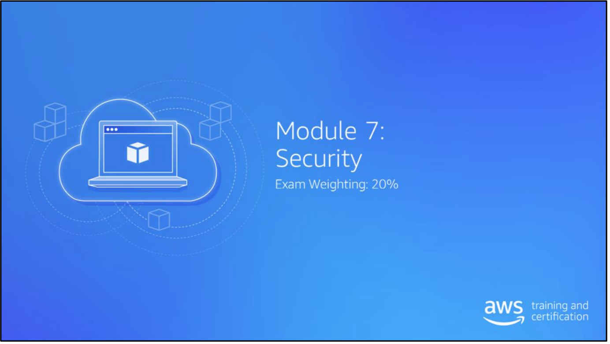

认证目标

设计信息安全管理系统和合规控制

利用AWS共享责任模型和全球基础设施设计安全控制

设计身份和访问管理控制

静态控制数据的设计保护

数据传输和网络周界控制的设计保护

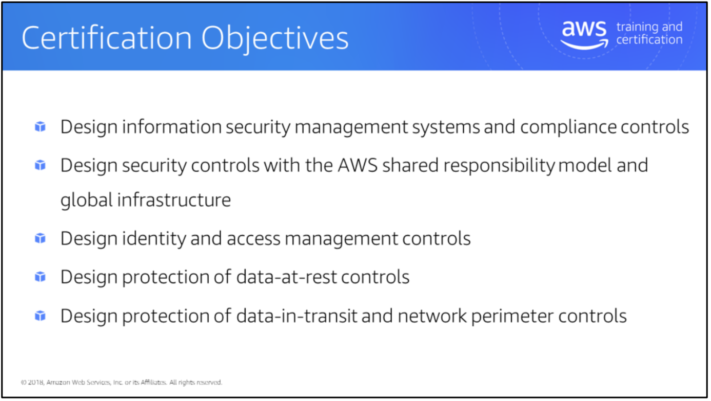

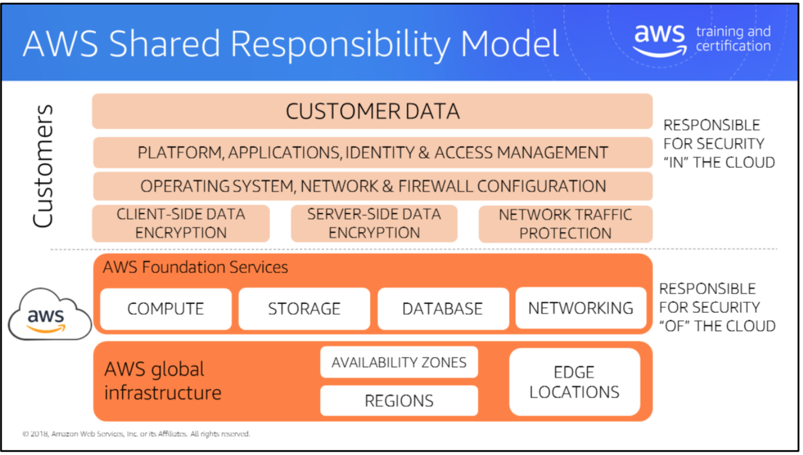

Resources:

- AWS Security Center: <https://aws.amazon.com/security>
- AWS Compliance: <https://aws.amazon.com/compliance/>
- Auditing Security Checklist for Use of AWS: <https://d0.awsstatic.com/whitepapers/compliance/AWS_Auditing_Security_Checklist.pdf>
- Amazon Web Services – Overview of Security Processes: <https://d0.awsstatic.com/whitepapers/aws-security-whitepaper.pdf>
- Amazon Web Services Risk and Compliance: <https://d0.awsstatic.com/whitepapers/compliance/AWS_Risk_and_Compliance_Whitepaper.pdf>
- Amazon Web Services – Automating Governance on AWS: <https://d0.awsstatic.com/whitepapers/compliance/Automating_Governance_on_AWS.pdf>
- Amazon Web Services – Security at Scale: Logging in AWS: <https://d0.awsstatic.com/whitepapers/compliance/AWS_Security_at_Scale_Logging_in_AWS_Whitepaper.pdf>
- Amazon Web Services – Security at Scale: Governance in AWS: <https://d0.awsstatic.com/whitepapers/compliance/AWS_Security_at_Scale_Governance_in_AWS_Whitepaper.pdf>
- AWS Re:Invent 2014: AWS Security Keynote Address: <https://www.youtube.com/watch?v=OEK7mHn4JLs>
- AWS Re:Invent 2015: Architecting for End-to-End Security in the Enterprise: <https://www.youtube.com/watch?v=nqaL5zJqFuo>
- Cloud Migration, Application Modernization and Security for Partners: <https://www.youtube.com/watch?v=UpeV4OqB6Us>

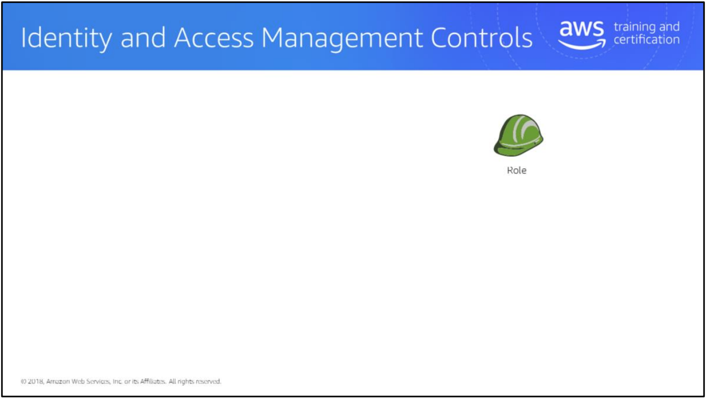

IAM roles can be used by users, EC2 instances, and other AWS services. Any one of these principals assumes a role, thus acquiring the rights associated with that role.

EC2 instances use an Instance Profile, a wrapper around the IAM role. Instance Profiles are displayed in the console, but cannot be edited. They are also exposed in the CLI and SDKs.

Resources:

- AWS Identity and Access Management: IAM Roles (Delegation and Federation): <http://docs.aws.amazon.com/IAM/latest/UserGuide/id_roles.html>
- AWS Identity and Access Management: How Roles Differ from Resource-Based Policies: <http://docs.aws.amazon.com/IAM/latest/UserGuide/id_roles_compare-resource-policies.html>
- AWS Identity and Access Management: Overview of IAM Policies: <http://docs.aws.amazon.com/IAM/latest/UserGuide/access_policies.html>

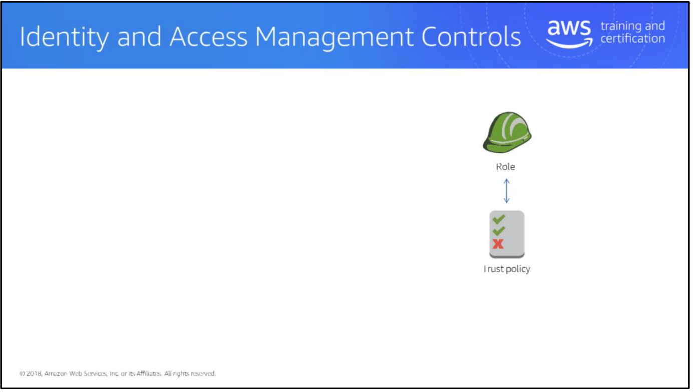

A role has a trust policy that defines which IAM users or AWS services can assume the role.

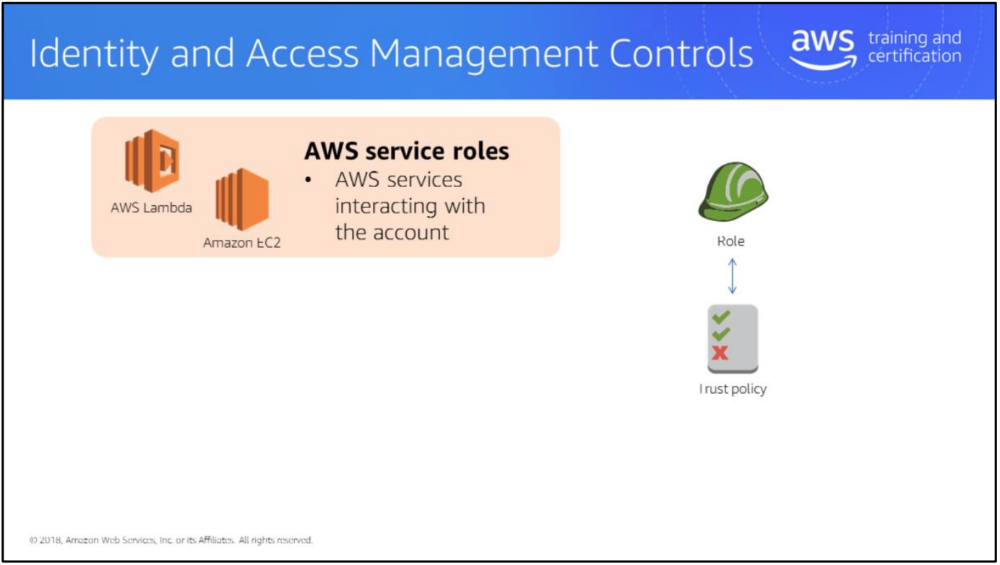

There are three types of trust policies. The first is AWS service roles, which allows specific AWS services to assume the role. Services are listed by FQDN: for example, ec2.amazon.com or datapipeline.amazon.com.

The trust policy can be edited and updated after creation. For example, you may create a custom trust policy that allows several AWS services to assume the role. Do this by selecting one of the services when creating the trust policy and then editing the policy to add the other services.

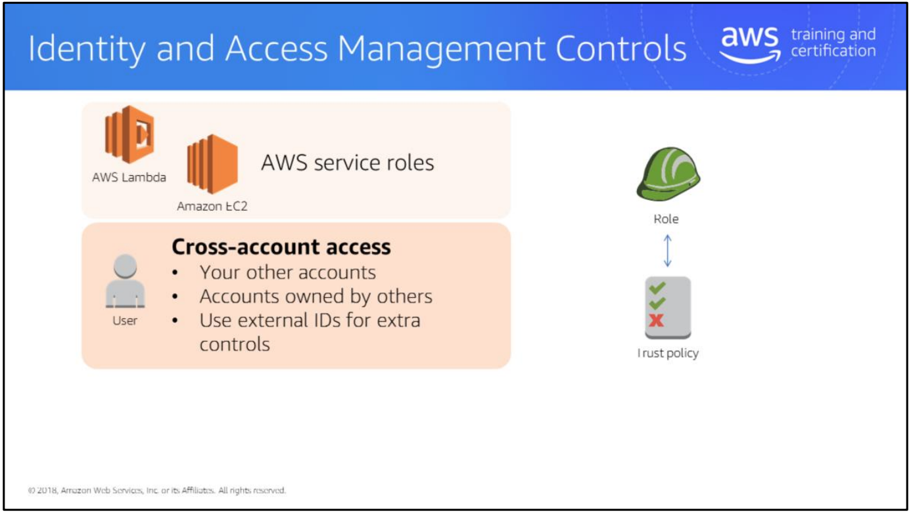

Cross-account access grants access from another AWS account. This could be an account you own, or an account owned by another person.

If the account is owned by another person or organization, it is a best practice to also provide a shared secret called an external ID. This stops one AWS account from guessing the role ARN for a different account and handing that to a common deputized AWS account. For more information, see <https://blogs.aws.amazon.com/security/post/Tx2Q5SSG3SFRRHO/How-to-Use-External-ID-When-Granting-Access-to-Your-AWS-Resources>

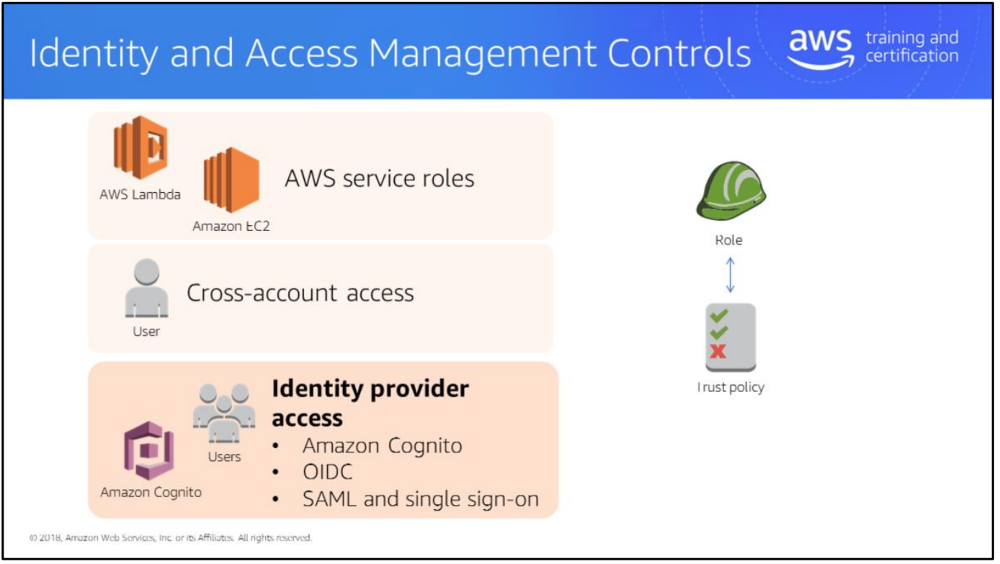

Identity provider access allows the role to be assumed by Amazon Cognito, OpenID Connect providers, or SAML identity providers.

Specifically, for signing in to the AWS Management Console, AWS provides a SAML single sign-on (SSO) endpoint where users can connect to initiate a single sign-on process.

Resources:

- AWS re:Invent 2014: Bring Your Own Identities – Federating Access to Your AWS Environment: <https://www.youtube.com/watch?v=debJ3o5w0MA>
- AWS Identity and Access Management: Using Identity Providers: <http://docs.aws.amazon.com/IAM/latest/UserGuide/id_roles_providers.html>
- Amazon Cognito identity pools: <http://docs.aws.amazon.com/cognito/latest/developerguide/identity-pools.html>

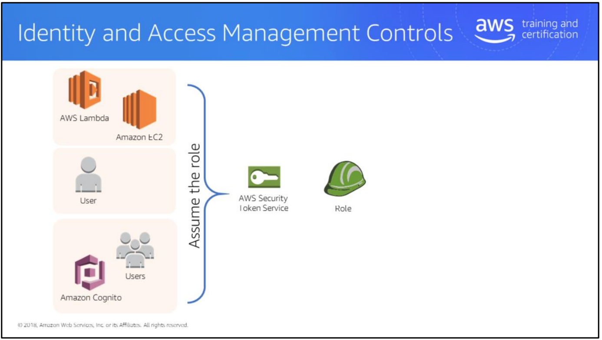

Any entity in the trust policy can assume the role.

Resources:

- What Is AWS Security Token Service? <http://docs.aws.amazon.com/IAM/latest/UserGuide/id_credentials_temp.html>
- AWS Security Token Service: Scenarios for Granting Temporary Access: <http://docs.aws.amazon.com/IAM/latest/UserGuide/id_credentials_temp.html#sts-introduction>
- AWS Security Token Service: Using the AssumeRole API to Delegate API Access: <http://docs.aws.amazon.com/IAM/latest/UserGuide/id_roles_use_switch-role-api.html>

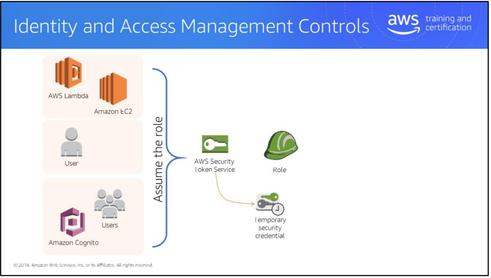

The trusted party assumes the role by requesting temporary security credentials from the AWS Security Token Service (AWS STS). STS verifies that the trusted party has permission to assume the role and returns a temporary security credential. The expiration time of the STS token depends on the API call and varies from a 15-minute minimum to a one-hour maximum for AssumeRole and AssumeRoleWithSAML, to 36 hours with GetFederationToken and GetSessionToken. For more information, see: <http://docs.aws.amazon.com/IAM/latest/UserGuide/id_credentials_temp_request.html>

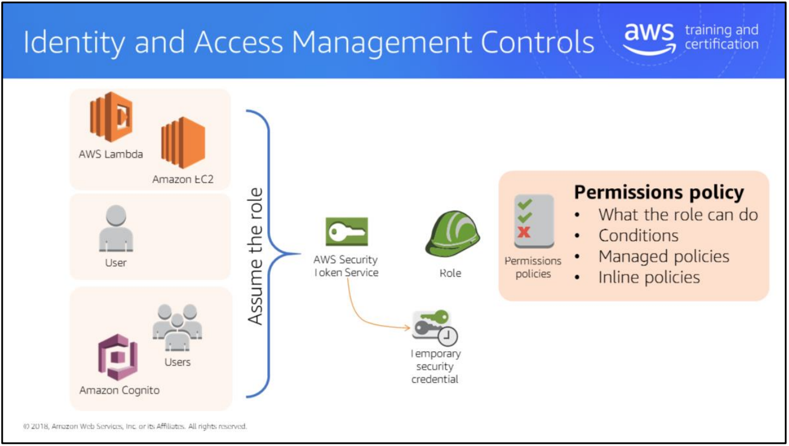

A role has a permissions policy that defines what the role can do with these temporary security credentials. This can specify AWS services and actions: for example, “CreateSubnet” in the Amazon VPC service.

Conditions can be used to restrict based on time, date, source IP, and other factors.

AWS provides managed policies that can be attached to a role. Inline policies can also be used where needed. Using managed policies will usually make ongoing management easier. See the following for more information: <http://docs.aws.amazon.com/IAM/latest/UserGuide/access_policies_managed-vs-inline.html>

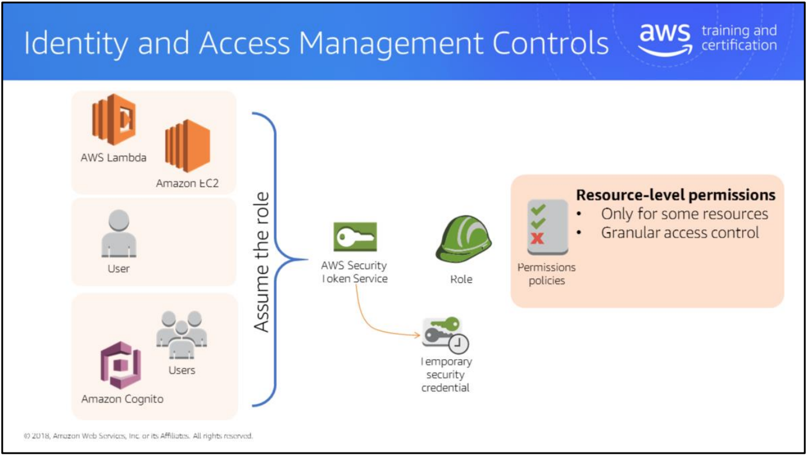

Resource-level permissions are only available for some AWS services and resources.

Resource-level permissions provide granular access control over specific objects within an AWS service. For example, the role’s permissions policy can list specific EC2 instances and specific EBS volumes.

Resource-level permissions don’t always allow all actions. For EC2 instances, actions such as Reboot, Start, Stop, and Terminate can be specified. Actions such as RunInstances can’t be specified, because you don’t know the InstanceID before the RunInstances call is complete. So, RunInstances applies to EC2 as a whole service, but not as a specific resource.

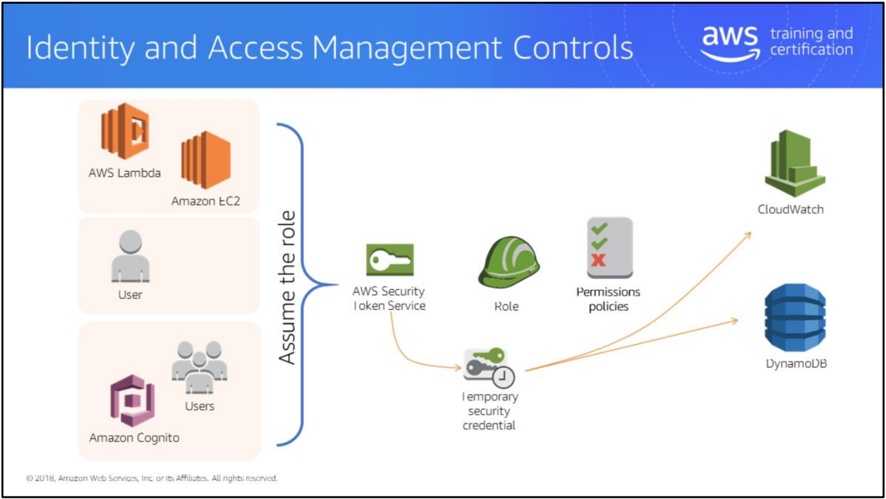

After credentials have been obtained from STS, the caller can initiate whatever actions are allowed by the role’s permissions policy. For example, you might be able to get CloudWatch metrics or write to and read from a DynamoDB table.

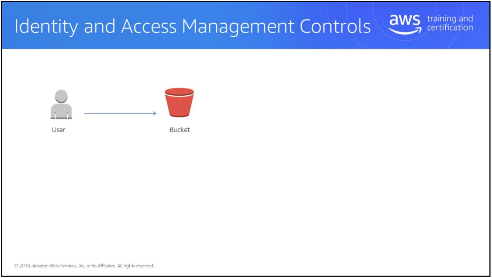

A use case is people or things accessing some of your AWS resources and you applying additional policies to those resources.

Set the situation as you have created a bucket and you have users within your organization that need to access the bucket.

Separate from roles; some resources can have resource policies applied to them.

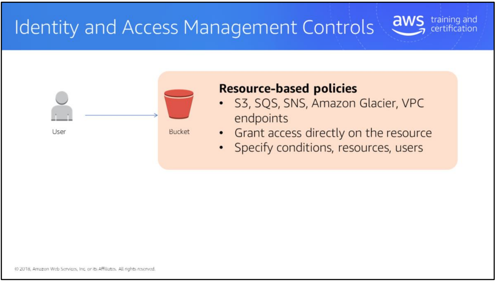

Services that can have resource-based policies include S3, SQS, SNS, Amazon Glacier, and VPC endpoints.

In addition, on top of IAM policies that you can apply to users or roles, you can apply policies at the resource level.

A resource-based policy specifies a principal. The principal lists which users can assume the role.

Resources:

- Amazon Simple Storage Service: Using Bucket Policies and User Policies: <http://docs.aws.amazon.com/AmazonS3/latest/dev/using-iam-policies.html>
- Amazon Simple Storage Service: Bucket Policy Examples: <http://docs.aws.amazon.com/AmazonS3/latest/dev/example-bucket-policies.html>

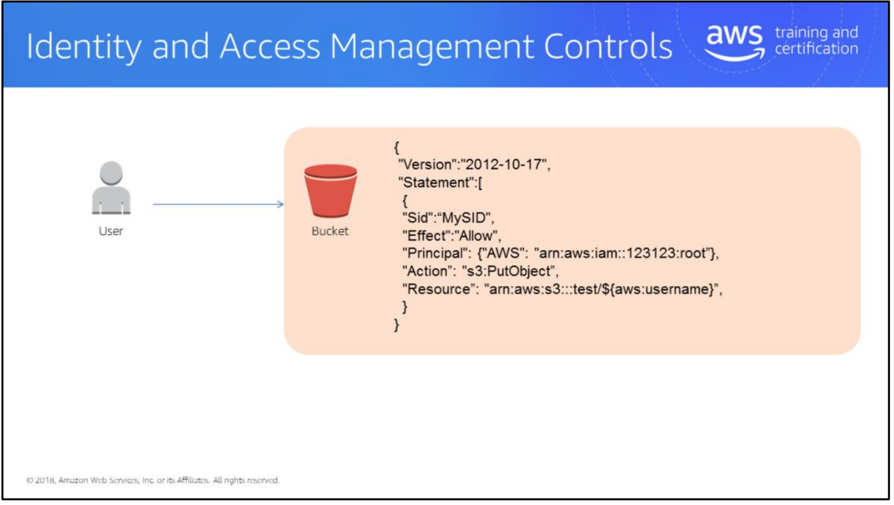

A resource policy is applied directly to an AWS resource, but resource policies can have resource statements in the policy statement, as shown in the example on the slide.

This is useful for separating resources within an S3 bucket. A resource policy could have multiple statements that reference different paths under one S3 bucket. Objects under the /readOnly path could have restrictive permissions, while a separate policy statement could allow read and write access to the /scratch path.

The example on the slide also uses the username policy variable. This is useful for separating individual user keys. Other policy variables also exist: <http://docs.aws.amazon.com/IAM/latest/UserGuide/reference_policies_variables.html>

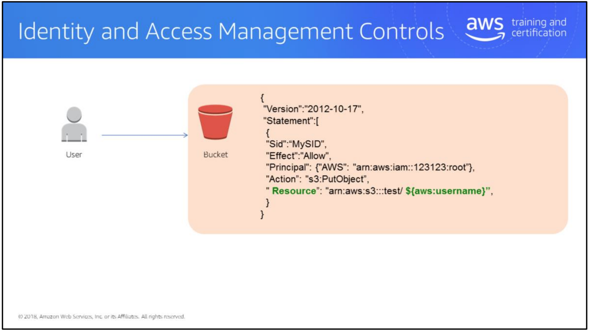

Any examples where you have done this on a resource?

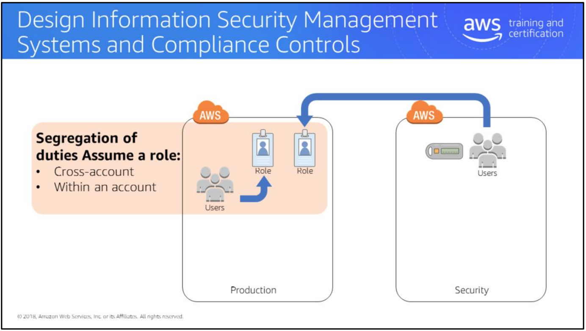

Related to the last question, here is a use case of CloudTrail logging and giving security access.

Instead of granting wide-ranging permissions to user accounts or groups, you can give users minimal permissions and allow them to assume roles. Users can assume one role at a time, with permissions appropriately scoped to particular tasks. If they need to do a different task, they can switch to the appropriate role. Roles are the permission vehicle. The CloudTrail logs show when a user has assumed a role.

This method works inside a single AWS account and across accounts as well.

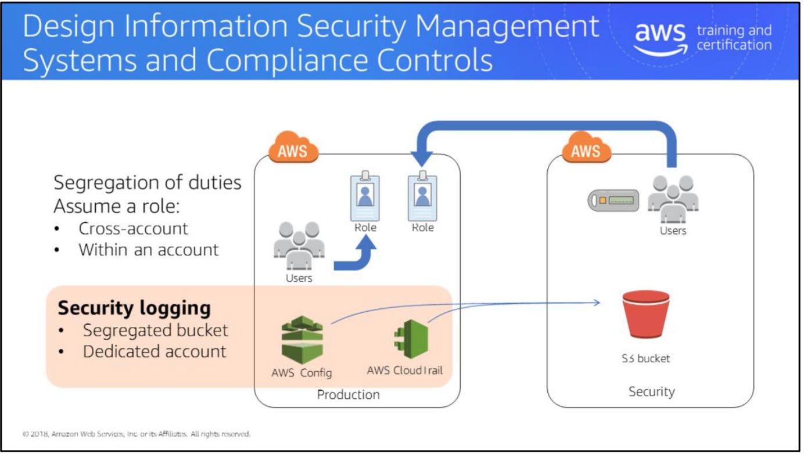

Use security auditing services such as AWS Config and AWS CloudTrail to create and keep logs of activity. Send the logs to a bucket outside the account. Ensure that the CloudTrail accounts have only PUT permissions, so they cannot read any of the logs.

A security team in the security account can then review and audit the logs.

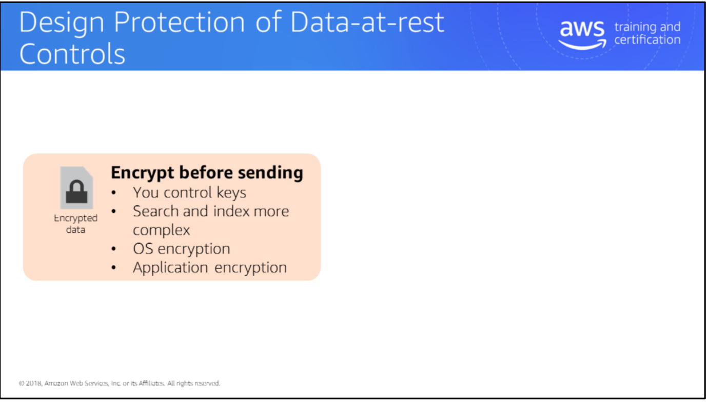

This example is a follow-up on the question we just had around protecting data at rest.

You can always encrypt data before sending it to AWS, at which point you own and control the keys. This is easy for object and unstructured storage. However, if you put data into a structured format, particularly a database, and the data is encrypted before it is stored, searching and indexing becomes complex.
