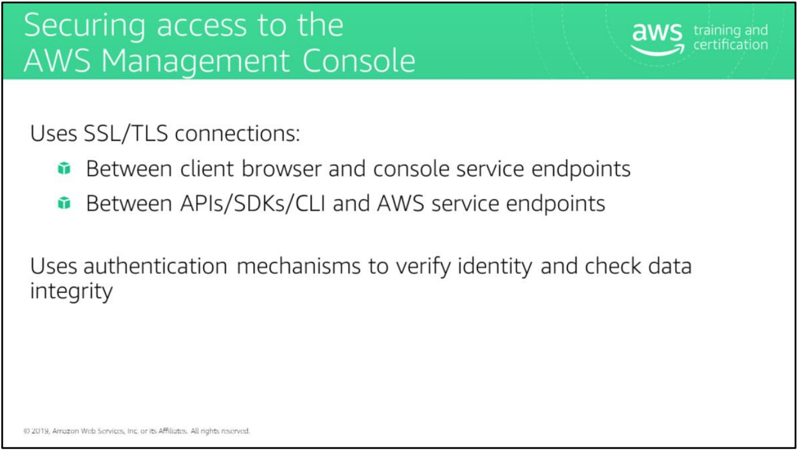

# module 7

Remote Desktop Protocol (RDP): Users who access Windows Terminal Services in the public cloud usually use the Microsoft Remote Desktop Protocol.

By default, RDP connections establish an underlying SSL/TLS connection. 

Secure Shell (SSH): SSH is the preferred approach for establishing administrative connections to Linux servers.

SSH is a protocol that, like SSL, provides a secure communications channel between the client and the server.

SSH supports tunneling for running applications (such as X-Windows) on top of SSH to protect the application session in transit.

Database server traffic: If clients or servers need to access databases in the cloud, they might need to traverse the internet as well.

The AWS Management Console uses SSL/TLS between the client browser and console service endpoints to protect AWS service management traffic. Traffic is encrypted, data integrity is authenticated, and the client browser authenticates the identity of the console service endpoint by using an X.509 certificate.

After an SSL/TLS session is established between the client browser and the console service endpoint, subsequent HTTP traffic is protected within the SSL/TLS session.

Alternatively, use AWS APIs to manage services from AWS either directly from applications or third-party tools, or via SDKs, or via AWS command line tools.

AWS APIs are web services (SOAP or REST) over HTTPS. SSL/TLS sessions are established between the client and the specific AWS service endpoint, depending on the APIs used, and all subsequent traffic, including the SOAP/REST envelope and user payload, is protected within the SSL/TLS session.

The slide lists a few commonly practiced techniques to protect data in transit.

For more information about AWS Certificate Manager, see <https://aws.amazon.com/certificate-manager/>.